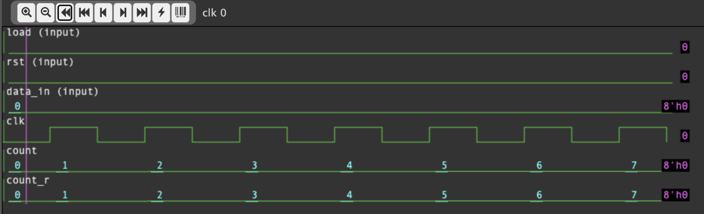
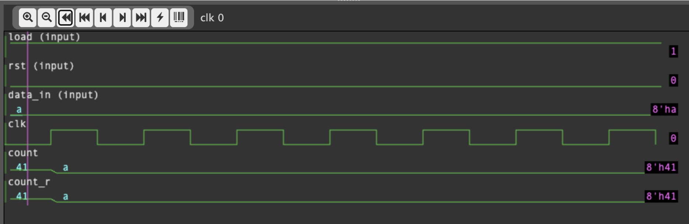
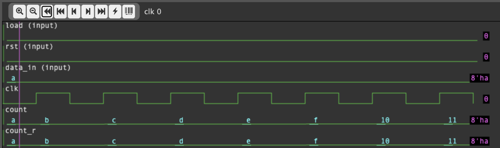
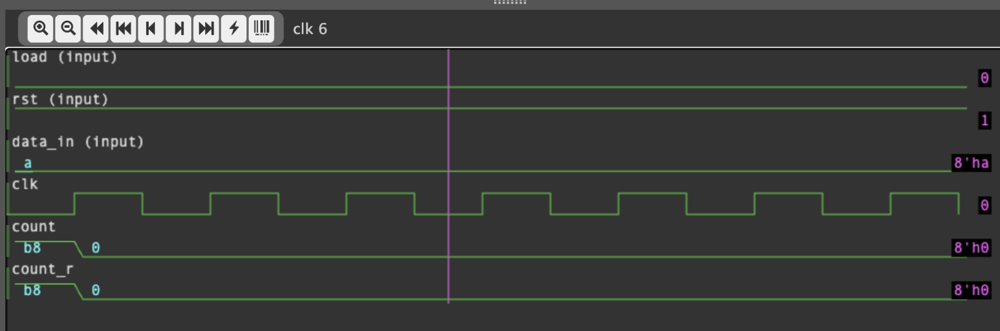

<!---

This file is used to generate your project datasheet. Please fill in the information below and delete any unused
sections.

You can also include images in this folder and reference them in the markdown. Each image must be less than
512 kb in size, and the combined size of all images must be less than 1 MB.
-->
This is an 8 bit counter with asynchronous reset, synchronous load, and tri-state output.

Below are the waveforms as shown in the 8bitworkshop interface. I didn't test the tri-state output as this is handled by the TinyTapeout IO pins.

